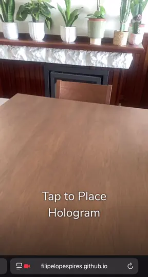
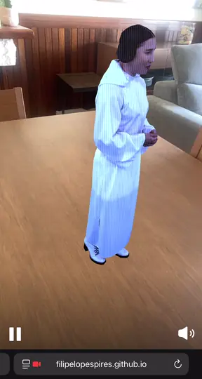

# May the 4th

> May the fourth bring Princess Leia closer to your reality than ever before.

    
    &nbsp;&nbsp;
    

    Try the WebAR experience <a href="https://filipelopespires.github.io/MayThe4th/">here</a> or scan the QR Code below:

    

## Introduction

Over 45 years ago, in a galaxy far, far away, Princess Leia appeared in holographic form pleading for help in the rebellion's most desperate hour. This iconic scene popularized holograms; inspiring and educating audiences everywhere about what they are, and what they could be.

As part of the team at [Arcturus](https://arcturus.studio/) working on volumetric players for the web, we wanted to celebrate the 45th anniversary of Star Wars with a special #starwarsday surprise. 45 years on, and holograms have become engrained in the history of pop culture.
As we reach a point where science fiction is becoming more science and less fiction, look back at the history of holograms in [Creative Bloq's timely feature](https://www.creativebloq.com/news/star-wars-hologram-free).

## The Scene

The demo is a playful homage to one of the most iconic moments in cinema: Princess Leia's holographic plea to Obi-Wan Kenobi. What makes this experience extra special is that the demo *is* that hologram message - the exact in-universe artifact Leia recorded for R2-D2 to deliver. A custom holographic shader sits on top of the volumetric capture to sell the movie-authentic look, flicker, scanlines and all.

To make it our own, we couldn't resist a wink at the audience. Instead of Leia's original, dramatic delivery:

> *"General Kenobi. Years ago you served my father in the Clone Wars. Now he begs you to help him in his struggle against the Empire. (...)"*

…our Leia goes full Gen-Z mode:

> *"Ok so this is super awkward but my father told me that a super long time ago you were like a total badass in that clone war thing. He told me to ask if you could super low key help him with his beef with the empire. (...)"*

…and keeps that tone all the way through to "help me Obi-Wan Kenobi, you're my only hope" - reimagined for the meme era.

## How to try it

Open the experience on a mobile device with a rear-facing camera, either by scanning the QR code above or by visiting [filipelopespires.github.io/MayThe4th](https://filipelopespires.github.io/MayThe4th/). Allow camera access when prompted, point your device at a flat surface around you, and Princess Leia's hologram will join you in your space.

The experience is built as a WebAR app - no install required, just a modern mobile browser.

## Why this repo exists

This project was originally hosted on [8th Wall](https://8thwall.org/)'s platform back in 2022. Since then, 8th Wall's hosted platform was retired and the tooling has been released as open source. With the original public deployment gone, I rebuilt and self-hosted the experience here via GitHub Pages so it can live on as part of my personal portfolio.

## Credits

Created during my time at [Arcturus](https://arcturus.studio/), in collaboration with several talented artists and developers from the team.

Special thanks to [Metastage](https://metastage.com/) for the volumetric capture and to [8th Wall](https://8thwall.org/) for the WebAR platform that made the original experience possible.
